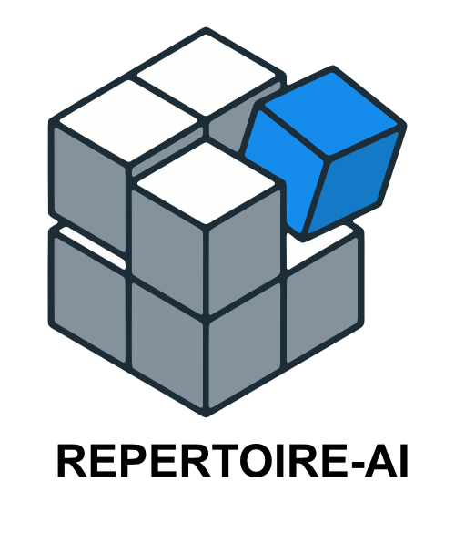

<p align="center">
  
</p>

# Repertoire

**The `apt-get` for AI agent skills.**

## What Repertoire does

A *skill* is a folder with a `SKILL.md` file that teaches an AI coding agent how
to do something: review code against your style guide, write docs for your
static site generator, use an internal tool. Codex, Claude Code, Cursor, Gemini
CLI, Copilot and many others all read the same format, but each one looks for
skills in a different directory.

Repertoire installs a skill into every agent you use with one command, keeps
those copies up to date, and never overwrites edits you made by hand.

```bash
repertoire add zensical --target all
```

That one line finds `zensical` in a skill catalog, checks that the package is
well formed, copies it into each agent's own skills folder, and records what
was installed so a later `repertoire update` can refresh it safely.

## Install

Repertoire ships as a single self-contained binary. Choose the method that fits
your platform.

=== "Windows"

    Install for the current user — no administrator rights required.

    **Installer (recommended)**

    Download `repertoire-setup-<version>.exe` from the
    [latest release](https://github.com/phillarmonic/repertoire-ai/releases/latest)
    and run it. The setup installs `repertoire.exe` under
    `%LOCALAPPDATA%\Programs\Repertoire`, automatically selects the build for your
    architecture (x64 or ARM64), and adds it to your user `PATH`. Open a new
    terminal afterwards so the `repertoire` command resolves.

    **PowerShell script**

    Prefer the command line? Run the installer script in PowerShell:

    ```powershell
    irm https://raw.githubusercontent.com/phillarmonic/repertoire-ai/master/install.ps1 | iex
    ```

    It downloads the binary for your architecture, verifies its SHA-256
    checksum, installs it to the same per-user location, and updates your `PATH`.
    Pin a specific version by setting an environment variable first:

    ```powershell
    $env:REPERTOIRE_VERSION = "v1.2.3"; irm https://raw.githubusercontent.com/phillarmonic/repertoire-ai/master/install.ps1 | iex
    ```

=== "Linux and macOS"

    Install the latest prebuilt binary:

    ```bash
    curl -fsSL https://raw.githubusercontent.com/phillarmonic/repertoire-ai/master/install.sh | bash
    ```

    Set `INSTALL_DIR` to change the target directory (default `~/.local/bin`), or
    pass a tag to pin the version:

    ```bash
    curl -fsSL https://raw.githubusercontent.com/phillarmonic/repertoire-ai/master/install.sh | bash -s -- v1.2.3
    ```

=== "Go"

    Build and install from source with Go 1.27 or newer:

    ```bash
    go install github.com/phillarmonic/repertoire-ai/cmd/repertoire@latest
    ```

Verify the installation, and update in place when needed:

```bash
repertoire --version
repertoire --self-update
```

## Quick start

If you have used a Linux package manager, the model is familiar: a catalog is a
repository, `add` installs a package, and `repertoire.yaml` is the manifest you
commit so others get the same set. Underlined terms across these docs link to
the [glossary](glossary.md); hover one for a short definition.

```bash
repertoire list --available
```

Shows every skill offered by the catalogs you have configured. With a fresh
install that is the built-in `phillarmonic` catalog.

```bash
repertoire add zensical --target all
```

Installs `zensical` into every supported agent and records it as something you
want kept installed. Drop `--target all` to install only into agents Repertoire
detects on your machine, or name agents explicitly with
`--target codex --target claude`.

```bash
repertoire list
```

Shows what Repertoire manages on this machine, where each skill came from, and
which agents have it.

```bash
repertoire update
```

Fetches catalog changes and refreshes every installed skill. If you edited an
installed copy by hand, `update` stops with an error instead of overwriting
it.

## Which command do I want?

- Install a skill and remember it: `repertoire add <skill>`
- Reinstall or repair skills already declared: `repertoire install`
- Pull newer versions: `repertoire update`
- Install everything a project declares (new machine, CI): `repertoire bootstrap`
- Same, but fetch catalog changes first: `repertoire sync`
- Something looks broken: `repertoire doctor`, then `repertoire doctor --fix`
- Use a private or local catalog: `repertoire catalog add <source>`
- Remove a skill: `repertoire remove <skill>`

Every command is described in the [command reference](commands.md).

## Let your agent drive Repertoire

Repertoire ships with a skill about itself. Install it once and your coding
agent knows how to run Repertoire for you:

```bash
repertoire add repertoire --target all
```

Then ask in plain language: "install the `zensical` skill for Codex and
Claude", "create a private skill catalog repository for our team", or "add a
`repertoire.yaml` to this project". The agent knows the commands, the manifest
formats, and the safety rules, and can scaffold a whole new catalog repository
from scratch. See [Let your agent drive Repertoire](agent-skill.md) for what it
covers and what it will refuse to do.

## Next steps

- [Set up a project or team](automation.md): commit a `repertoire.yaml` so
  every contributor and CI job gets the same skills.
- [Private and company catalogs](private-repositories.md): publish your own
  skills from a private Git repository.
- [Let your agent drive Repertoire](agent-skill.md): install the built-in
  `repertoire` skill and delegate all of the above to your agent.
- [Command reference](commands.md): every command, flag, and edge case.
- [Troubleshooting](troubleshooting.md): what the common error messages mean
  and how to fix them.
- [Glossary](glossary.md): the handful of terms Repertoire uses, in one place.
- Concepts: [Manifests and state](concepts/manifests.md),
  [Catalogs](concepts/catalogs.md),
  [Targets and security](concepts/targets-security.md).
- [Contributing](contributing.md): build and test Repertoire itself.
